# Diabetes Hospital Readmission Analysis (MySQL + Python)

In this project I looked at why diabetic patients get readmitted to hospital within 30 days, and whether a hospital can predict who is at risk and target follow-up care at those patients in a way that actually saves money.

Tools used: Python (pandas, scikit-learn, statsmodels, matplotlib, plotly), MySQL, Excel.

About 1 in 9 diabetic patients in this data came back within 30 days of discharge. According to [AHRQ HCUP](https://hcup-us.ahrq.gov/reports/statbriefs/sb278-Conditions-Frequent-Readmissions-By-Payer-2018.jsp) one readmission costs around $15,200 on average, and under Medicare's [Hospital Readmissions Reduction Program](https://www.cms.gov/medicare/payment/prospective-payment-systems/acute-inpatient-pps/hospital-readmissions-reduction-program-hrrp) hospitals with too many readmissions lose up to 3% of their Medicare payments. Hospitals can't give extra follow-up care to every patient, so the useful question is which patients to focus on.

<p align="center">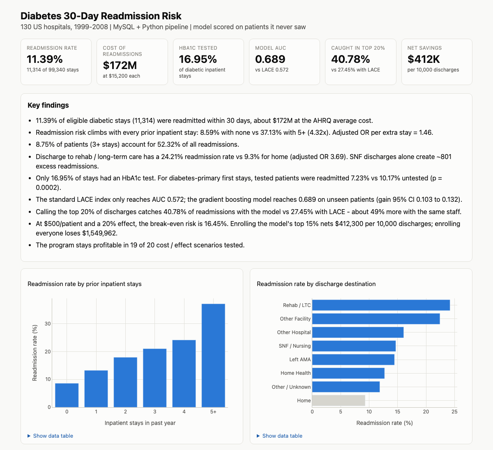</p>

## Main results

- Data: 101,766 hospital stays from 130 US hospitals. After cleaning, 99,340 stays (69,987 patients) were used, stored in a MySQL database of 9 tables (~696K rows).
- 11.39% of stays were readmitted within 30 days, which is 11,314 readmissions, or about $172M.
- 8.75% of patients (the ones with 3+ stays) were responsible for 52.3% of all readmissions.
- Patients discharged to rehab / long-term care came back 24.2% of the time vs 9.3% for patients sent home (adjusted odds ratio 3.69).
- Only 17% of stays had an HbA1c test. Diabetes patients who were tested were readmitted less often (7.2% vs 10.2%, p = 0.0002).
- My gradient boosting model got ROC-AUC 0.689 on patients it never saw during training. The LACE score that hospitals commonly use got 0.572.
- If staff can follow up with 20% of patients, picking them with the model catches 40.8% of readmissions vs 27.5% with LACE (49% more).
- Enrolling the model's top 15% in a follow-up program saves about $412K per 10,000 discharges. Enrolling everyone loses about $1.55M.
- The program stayed profitable in 19 out of 20 cost scenarios I tested.

## Questions I wanted to answer

1. How big is the readmission problem and where is it concentrated?
2. Which factors are linked to readmission, and which still matter after adjusting for the others?
3. Can a model predict readmission better than the LACE index?
4. With a limited budget, how many patients should a follow-up program enrol, and which ones?
5. Does the model work equally well for different race, gender and age groups?

## Dataset

[Diabetes 130-US Hospitals for Years 1999-2008](https://archive.ics.uci.edu/dataset/296/diabetes+130-us+hospitals+for+years+1999-2008) from the UCI Machine Learning Repository (CC BY 4.0). It was released with the paper by [Strack et al. 2014](https://pmc.ncbi.nlm.nih.gov/articles/PMC3996476/). It has 101,766 inpatient stays and 50 columns covering demographics, admission and discharge codes, up to 3 ICD-9 diagnosis codes, lab results, 23 diabetes drugs, and whether the patient was readmitted. The pipeline downloads it by itself.

## How the pipeline works

`python main.py` runs these steps in order:

| Step | Script | What it does |
|---|---|---|
| 1 | `src/download_data.py` | downloads the dataset zip from UCI |
| 2 | `src/clean_data.py` | data quality checks, handles the `?` missing values, drops 3 bad rows, groups ICD-9 codes into disease groups, calculates the Charlson comorbidity index and LACE score, turns the 23 drug columns into a long table |
| 3 | `src/load_to_mysql.py` | creates the tables (foreign keys, CHECK constraints, indexes), loads ~600K rows in batches, checks row counts, creates the views and stored procedures |
| 4 | `src/run_sql_analysis.py` | runs the 20 queries in `sql/04_analysis_queries.sql` and saves each result |
| 5 | `src/eda_stats.py` | chi-square tests (with Bonferroni correction), Mann-Whitney U, two-proportion z-test, multivariable logistic regression |
| 6 | `src/risk_model.py` | compares LACE vs logistic regression vs gradient boosting, bootstrap confidence intervals, lift, calibration, feature importance, fairness check, writes risk scores back to MySQL |
| 7 | `src/cost_benefit.py` | turns the risk scores into a decision in dollars, plus a sensitivity analysis |
| 8 | `src/build_report.py` | Excel report, HTML dashboard and the care team call list |

## Database

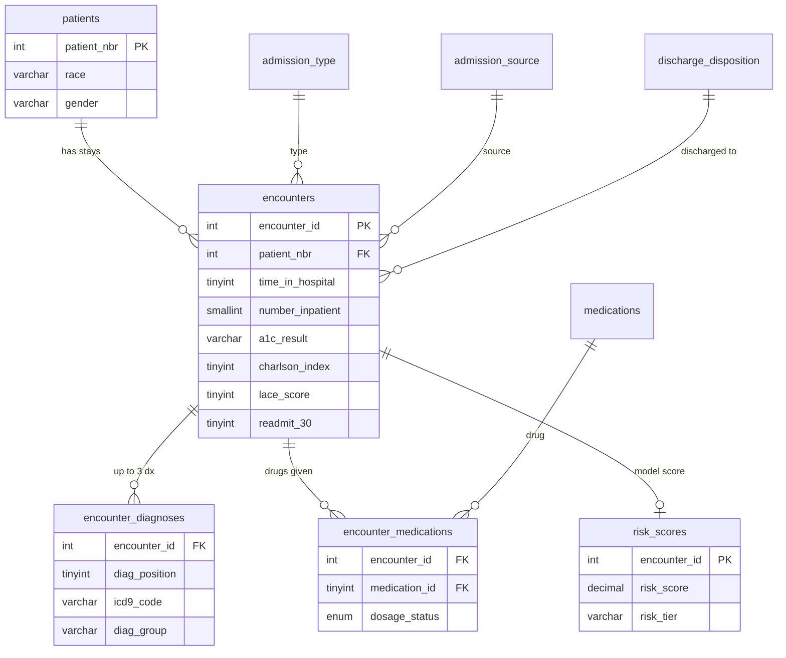
```mermaid
erDiagram
    patients ||--o{ encounters : "has stays"
    admission_type ||--o{ encounters : "type"
    admission_source ||--o{ encounters : "source"
    discharge_disposition ||--o{ encounters : "discharged to"
    encounters ||--o{ encounter_diagnoses : "up to 3 dx"
    encounters ||--o{ encounter_medications : "drugs given"
    medications ||--o{ encounter_medications : "drug"
    encounters ||--o| risk_scores : "model score"

    patients {
        int patient_nbr PK
        varchar race
        varchar gender
    }
    encounters {
        int encounter_id PK
        int patient_nbr FK
        tinyint time_in_hospital
        smallint number_inpatient
        varchar a1c_result
        tinyint charlson_index
        tinyint lace_score
        tinyint readmit_30
    }
    encounter_diagnoses {
        int encounter_id FK
        tinyint diag_position
        varchar icd9_code
        varchar diag_group
    }
    encounter_medications {
        int encounter_id FK
        tinyint medication_id FK
        enum dosage_status
    }
    risk_scores {
        int encounter_id PK
        decimal risk_score
        varchar risk_tier
    }
```

Row counts: patients 71,515, encounters 101,763, encounter_diagnoses 303,487, encounter_medications 120,050, risk_scores 99,340, plus 4 small lookup tables.

The raw file has 23 drug columns that are mostly "No", so in the database I only keep the drugs that were actually given (120K rows instead of 2.3M cells). Stays where the patient died or went to hospice are kept in the database but filtered out by the `vw_eligible_encounters` view, because those patients can't be readmitted (same as the original paper).

SQL concepts used: CTEs, window functions (ROW_NUMBER, RANK, DENSE_RANK, FIRST_VALUE, running totals with SUM OVER), conditional aggregation to pivot diagnoses and drugs, views, a stored function, and stored procedures (one of them builds its query dynamically, so I check the column name against a whitelist to stop SQL injection).

Some things you can run after the pipeline:

```sql
CALL sp_readmission_profile('discharge_group');
CALL sp_high_risk_cohort(2, 10);
SELECT * FROM vw_care_team_worklist WHERE risk_tier = 'High' ORDER BY predicted_risk_pct DESC LIMIT 10;
```

## Findings

### 1. More past hospital stays = higher risk
Patients with 5 or more inpatient stays in the past year were readmitted 37.1% of the time, compared with 8.6% for patients with none (4.3x). This still holds after adjusting for other factors: each extra past stay increases the odds by 46% (odds ratio 1.46, 95% CI 1.41-1.51). Later visits of the same patient were also riskier: 9.0% on the first visit vs 23.9% on the 4th visit or later.

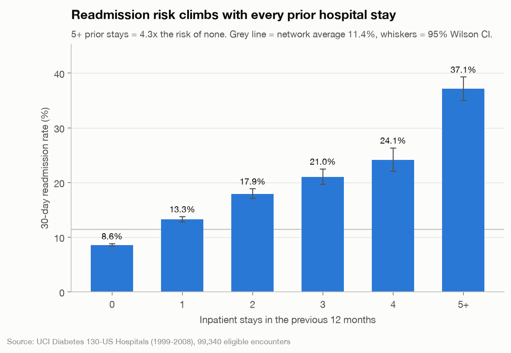

### 2. A small group of patients causes most readmissions
The 8.75% of patients who had 3 or more stays account for 52.3% of all readmissions. A program aimed only at these patients would cover about half of the problem.

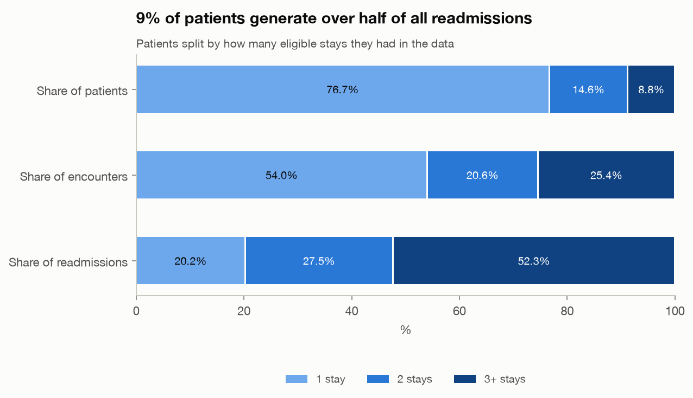

### 3. Discharge destination matters the most
Patients sent to rehab / long-term care (24.2%), other facilities (22.4%) and skilled nursing facilities (14.7%) were readmitted much more than patients sent home (9.3%). Skilled nursing discharges alone add about 801 extra readmissions compared with the home rate, which is roughly $12.2M. This was also the most important feature in the model.

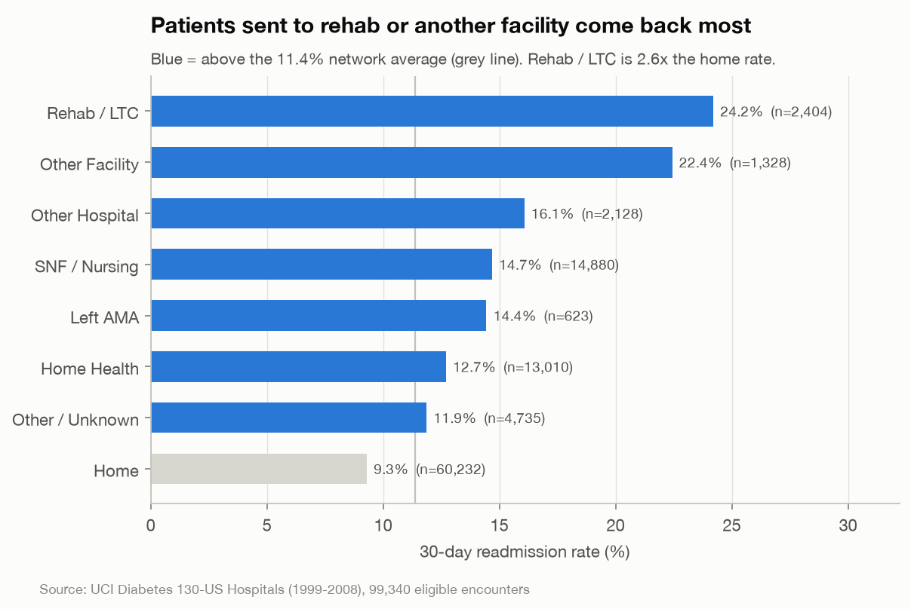

### 4. HbA1c is rarely tested
Only 16.95% of stays had an HbA1c test. For patients admitted mainly for diabetes, untested stays had a 14.7% readmission rate vs 9.6% for tested ones. Using only each patient's first stay (so the rows are independent), it was 10.2% vs 7.2%, and the z-test gave p = 0.0002. The original paper found something similar. Across all diagnoses together the HbA1c result was not significant after Bonferroni correction, so the difference seems specific to diabetes admissions. This is an association, not proof that testing causes fewer readmissions.

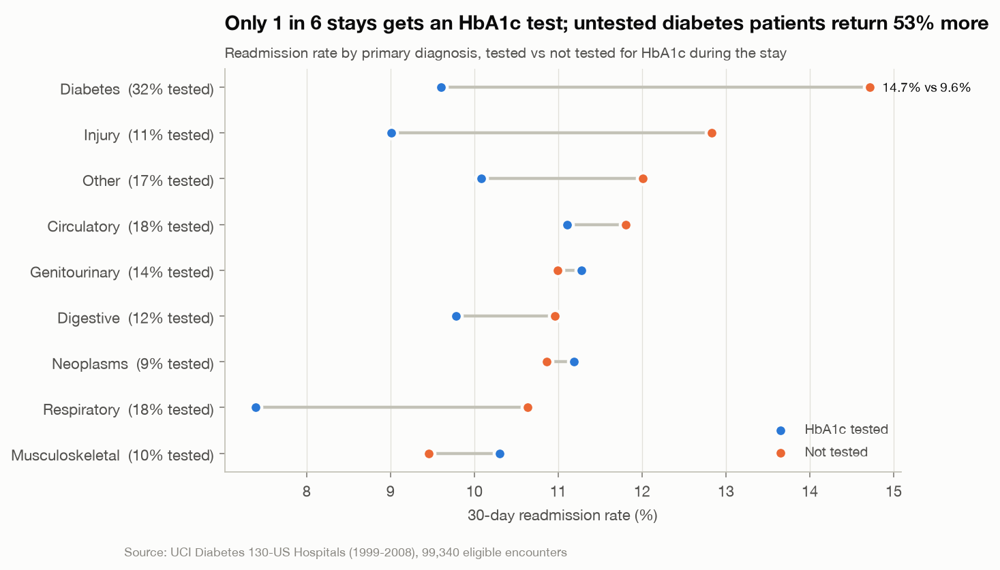

### 5. What still matters after adjusting
I ran a logistic regression on 69,987 first stays. Discharge destination, past inpatient and ER visits, age 60+, being on diabetes medication, and having the insulin dose lowered were all still significant. Respiratory and musculoskeletal diagnoses had lower risk than circulatory ones.

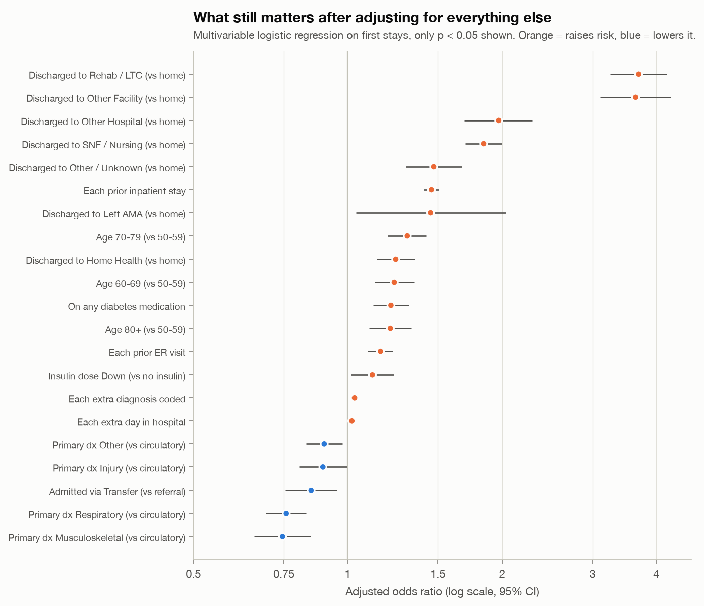

A few more results from the SQL queries (all saved in `outputs/sql_results/`):
- Just 15 of the 715 primary ICD-9 codes cover 43.6% of readmissions. Heart failure (code 428) alone is 8.5%.
- Nephrology has the highest readmission rate of any specialty (16.1%).
- The standard LACE tiers do separate risk (17.0% for high vs 8.3% for low), but only 10.7% of stays fall in the high tier.

## Risk model

The target is readmission within 30 days, and the model uses 28 features (past visits, discharge plan, diagnoses, labs, medications, comorbidity). I left race and gender out of the features and only used them for the fairness check.

One thing I had to be careful about: 16,773 patients have more than one stay. With a normal random split, the same patient could end up in both train and test, which would make the results look better than they really are. So I split by patient instead: `GroupShuffleSplit` (80/20) for the test set and `GroupKFold` (5 folds) for tuning, plus an assert to check that no patient is in both.

Results on the test set (19,773 stays):

| Model | CV AUC | Test ROC-AUC | Test PR-AUC | Readmissions caught in top 20% | Lift in top 10% |
|---|---|---|---|---|---|
| LACE index (baseline) | 0.573 | 0.572 | 0.142 | 27.5% | 1.55x |
| Logistic regression | 0.660 | 0.670 | 0.222 | 37.9% | 2.34x |
| Gradient boosting (tuned) | 0.679 | 0.689 | 0.243 | 40.8% | 2.55x |

I used a bootstrap (500 resamples) to check the improvement over LACE. The 95% interval for the AUC gain was 0.103 to 0.132, so it's not just luck. The top 10% of patients by risk were readmitted 28.9% of the time (2.55x the average). The predicted probabilities also line up well with the actual rates (calibration chart), which matters because the cost analysis uses them directly.

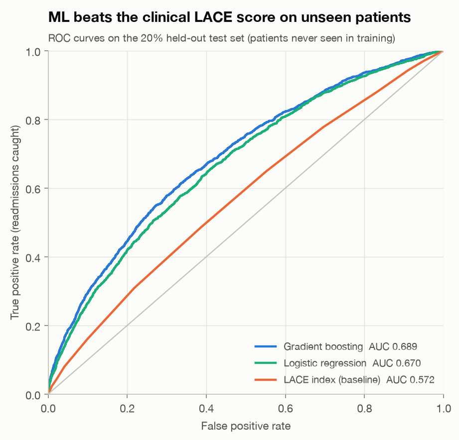 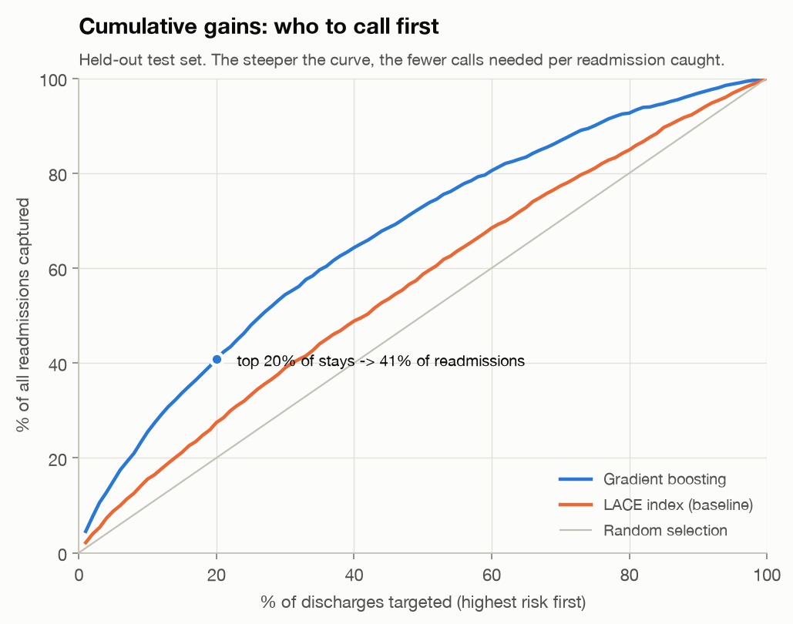
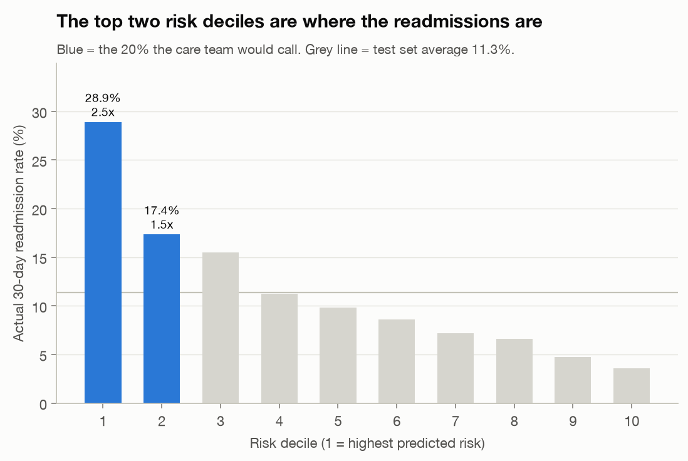 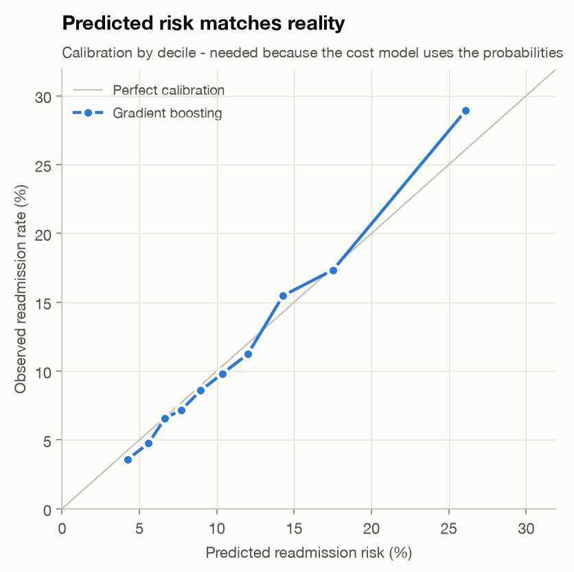

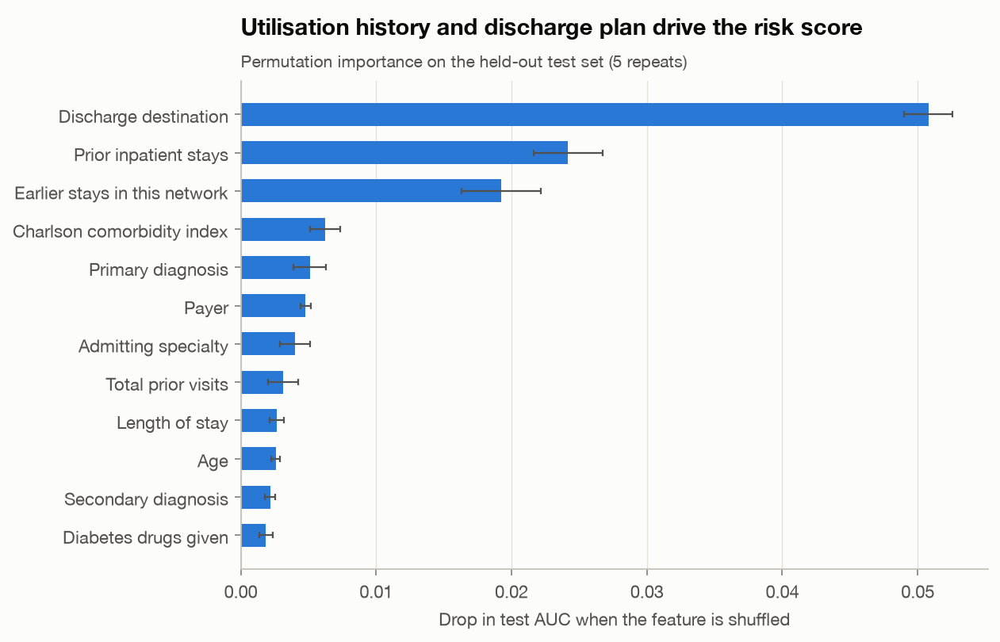

Fairness check: the AUC was similar across race groups (0.673-0.690, except Hispanic at 0.797, but that group only has 396 stays) and gender (0.677 male, 0.700 female). The model does worse for patients aged 70+ (AUC 0.651), so that group would need monitoring.

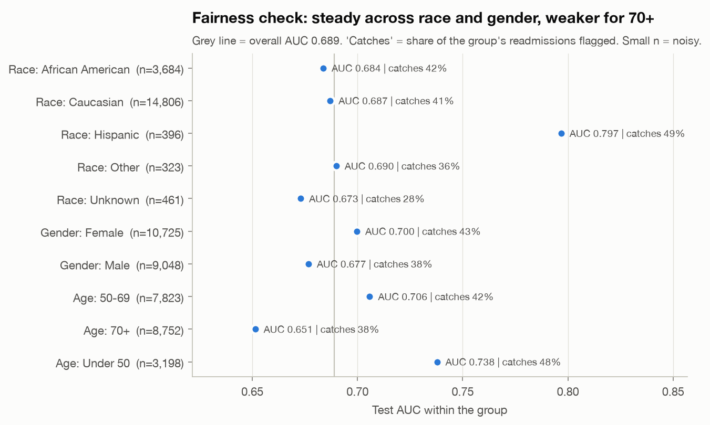

At the end I scored every stay with out-of-fold predictions (AUC 0.681), so no stay is scored by a model that saw that patient in training. The scores go back into MySQL (`risk_scores` table), and the `vw_care_team_worklist` view turns them into a call list with the reasons for each flag.

## Cost-benefit analysis

Assumptions:

| Assumption | Value | Where it comes from |
|---|---|---|
| Cost of one readmission | $15,200 | AHRQ HCUP Statistical Brief #278 (2018) |
| Program cost per patient | $500 | typical follow-up / transition coach program (I also tested $250-$1,000) |
| Program effect | 20% lower readmission risk | lower than the Care Transitions Intervention trial (11.9% -> 8.3%, about 30%) and Project RED (about 30%), I also tested 10-30% |

With these numbers the program only pays off for patients whose risk is above 16.45% (break-even = $500 / (20% x $15,200)). The average risk is 11.4%, so enrolling everyone loses money. Only targeting high-risk patients makes it worth it.

| Strategy (per 10,000 discharges) | Enrolled | Readmissions prevented | Net savings | ROI |
|---|---|---|---|---|
| Enrol everyone | 10,000 | 227.0 | -$1,549,962 | -31.0% |
| Random 20% | 2,000 | 45.7 | -$305,174 | -30.5% |
| LACE top 20% | 2,000 | 62.3 | -$53,032 | -5.3% |
| LACE >= 10 rule | 1,057 | 36.2 | +$22,162 | 4.2% |
| Model top 20% | 2,000 | 92.6 | +$406,666 | 40.7% |
| Model top 15% (best) | 1,500 | 76.5 | +$412,300 | 55.0% |

The dataset has around 9,900 eligible discharges per year, so $412K per 10,000 discharges is roughly one year of savings for this hospital network.

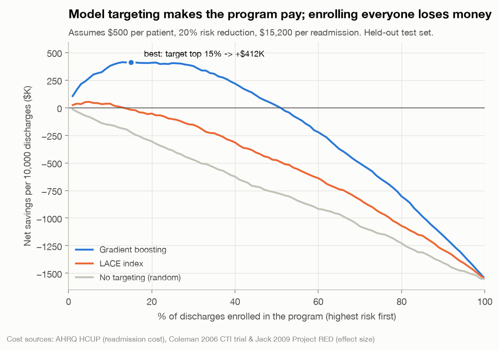

Since the costs are assumptions, I re-ran the analysis for 20 combinations of program cost and program effect. It was profitable in 19 of them. The only one that lost money was the worst case ($1,000 per patient with only a 10% effect).

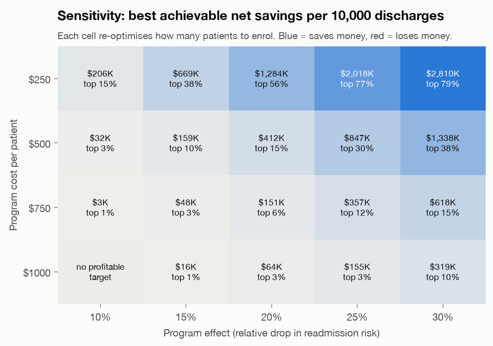

## Recommendations

1. Score every diabetic patient at discharge and enrol the top 15-20% in a follow-up program (phone call within 48 hours, medication check, follow-up appointment booked before they leave).
2. Have a separate plan for patients with 2+ admissions in the past year. They are under 9% of patients but cause more than half of the readmissions.
3. Improve hand-offs to nursing, rehab and long-term care facilities, for example sending the discharge summary and medication list the same day.
4. Make HbA1c testing standard for diabetic inpatients, since only 1 in 6 stays is tested now.
5. Use the model score instead of the LACE >= 10 rule, and re-check calibration and group performance (especially 70+) regularly.

## Output files

All of these are created in `outputs/` when you run `python main.py`:

| File | What it is |
|---|---|
| `readmission_analysis_report.xlsx` | Excel report with 7 sheets: summary, data quality, SQL results, stats tests, model results, cost-benefit, top 500 high-risk stays |
| `readmission_dashboard.html` | interactive dashboard (download it and open in a browser) |
| `care_team_worklist.csv` | 9,934 highest-risk stays with the reasons they were flagged, exported from the MySQL view |
| `charts/` | the 13 charts used in this README |
| `sql_results/` | output of each of the 20 SQL queries |
| `stats_*.csv` | chi-square, Mann-Whitney, z-test and odds ratio tables |
| `model_*.csv` | model metrics, risk deciles, feature importance, fairness check |
| `cost_*.csv` | strategy comparison, savings curves, sensitivity grid |
| `key_metrics.json` | the main numbers from every step |

## How to run it

You need Python 3.12 and MySQL 8 or newer running.

```bash
git clone https://github.com/Beast2074/
diabetes-readmission-analytics.git
cd diabetes-readmission-analytics

python3 -m venv venv
source venv/bin/activate          # on Windows: venv\Scripts\activate
pip install -r requirements.txt

cp .env.example .env              # put your MySQL username and password in .env
python main.py                    # takes around 3-4 minutes
```

- To run a single step: `python -m src.risk_model`
- To start from a later step: `python main.py --start 6`
- The script creates the `readmission_db` database itself (you can change the name in `.env`).
- Random seeds are fixed, so you should get the same numbers.

## Project structure

```
main.py                      runs all the steps
config.py                    file paths, database settings, cost assumptions
sql/
    01_schema.sql            tables, keys, constraints, indexes
    02_views.sql             views (eligible stays, first stays, model data, KPIs, worklist)
    03_procedures.sql        stored function and procedures
    04_analysis_queries.sql  the 20 business questions
src/
    download_data.py
    clean_data.py
    clinical_scores.py       ICD-9 groups, Charlson index, LACE score
    load_to_mysql.py
    run_sql_analysis.py
    eda_stats.py
    risk_model.py
    cost_benefit.py
    build_report.py
    dashboard_template.html
    db.py, plot_style.py, utils.py
outputs/                     everything the pipeline creates
docs/                        image for this README
```

## Limitations

- The data is from 1999-2008, so the model would need to be retrained on recent data before anyone used it for real.
- There are no admission dates in the data. Like the original paper, I assumed that a lower encounter_id means an earlier visit.
- My LACE score is an approximation. The dataset has ER visits for the past year instead of 6 months, and I could only calculate Charlson from 3 diagnosis codes, so the real LACE might do a bit better.
- The costs are published averages, not a specific hospital's numbers. That's why I did the sensitivity analysis.
- The statistical results are associations from observational data, not proof of cause and effect.

## References

- Strack B. et al. (2014). Impact of HbA1c Measurement on Hospital Readmission Rates: Analysis of 70,000 Clinical Database Patient Records. BioMed Research International. [link](https://pmc.ncbi.nlm.nih.gov/articles/PMC3996476/)
- AHRQ HCUP Statistical Brief #278: Clinical Conditions With Frequent, Costly Hospital Readmissions by Payer, 2018. [link](https://hcup-us.ahrq.gov/reports/statbriefs/sb278-Conditions-Frequent-Readmissions-By-Payer-2018.jsp)
- van Walraven C. et al. (2010). Derivation and validation of an index to predict early death or unplanned readmission after discharge from hospital to the community (LACE index). CMAJ.
- Coleman E.A. et al. (2006). The Care Transitions Intervention: results of a randomized controlled trial. Archives of Internal Medicine.
- Jack B.W. et al. (2009). A reengineered hospital discharge program to decrease rehospitalization: a randomized trial (Project RED). Annals of Internal Medicine.

## License

MIT. The dataset is from the UCI Machine Learning Repository (CC BY 4.0).
